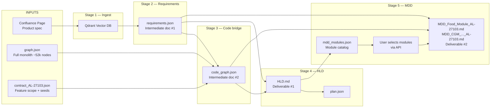
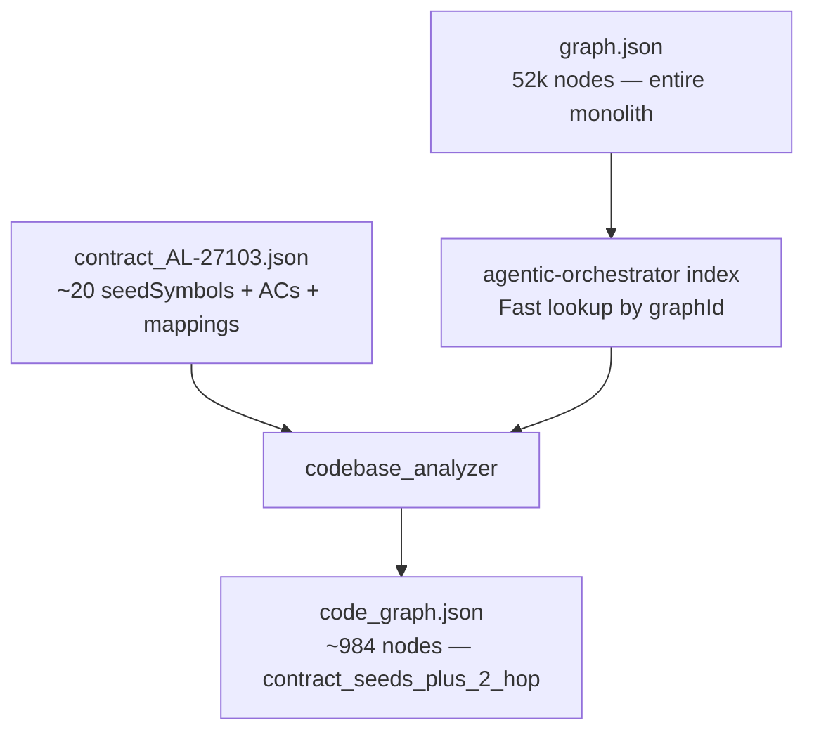
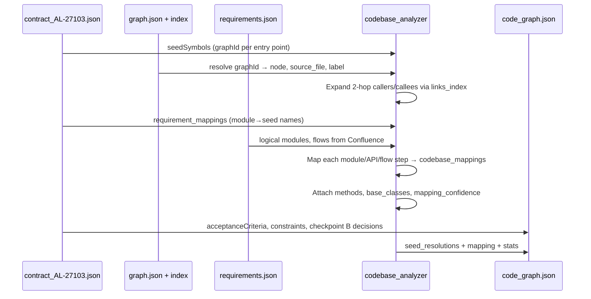
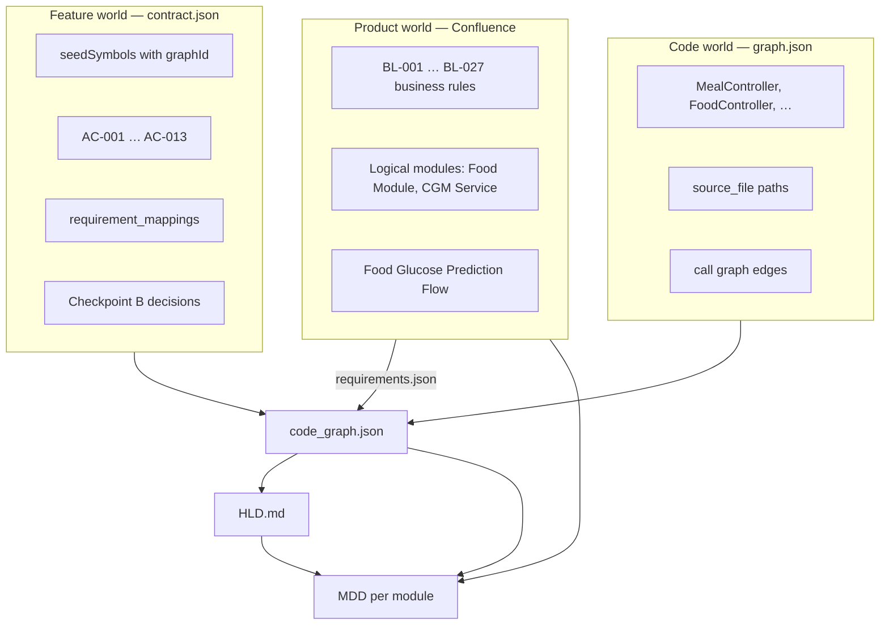

# MDD_NEW — End-to-End Pipeline Architecture (Presentation)

**Scope:** Full journey from **inputs** → **intermediate artifacts** → **HLD** → **module selection** → **MDD output**  
**Example feature:** `AL-27103` — CGM Food Glucose Prediction  
**Focus:** How `graph.json` + `contract_AL-27103.json` changed the pipeline and improved accuracy

---

## 1. One-Sentence Summary

We built a pipeline that reads **Confluence requirements**, scopes **one Jira feature** via a **contract file**, grounds it in the **entire monolith code graph**, produces an **HLD**, then lets the architect **pick logical modules** and get **SOP-036 MDD documents** — with real C# symbols instead of LLM guesses.

---

## 2. End-to-End Flow (Input → Output)



| Step | What goes in | What comes out | Who runs it |
|------|----------------|----------------|-------------|
| 0 | Confluence URL + credentials | Chunks in Qdrant | `POST /api/ingestion/start` |
| 1 | Qdrant corpus | `requirements.json` | `POST /api/requirements/generate` |
| 2 | `graph.json` + `contract_*.json` + `requirements.json` | `code_graph.json` | `POST /api/codebase/analyze` |
| 3 | `requirements.json` + `code_graph.json` | `HLD.md` + `plan.json` | `POST /api/hld/generate` |
| 4 | `HLD.md` + user module pick | `MDD_{module}_{ticket}.md` | `POST /api/mdd/generate` |

---

## 3. The Two-File Code Strategy (Key Change)

### Before (problem)

Early pipeline versions tried to infer code structure from **Confluence text alone** or from **ad-hoc LLM guesses**. That led to:

- Wrong controller names in API tables
- Invented infrastructure (Redis, Qdrant, EF) not in the real codebase
- No link from acceptance criteria (AC) to actual C# methods
- Entire monolith too large to put in an LLM prompt

### After (solution): Static graph + Per-feature contract

| File | Role | Scope | Changes? |
|------|------|-------|----------|
| **`graph.json`** | Precomputed Graphify export of the **whole monolith** | ~52,365 nodes, ~75k links | **Static** — one file for all features (`GRAPH_PATH` in `.env`) |
| **`contract_AL-27103.json`** | Curated **feature slice** for one Jira ticket | Seeds, ACs, BL mappings, target projects | **Per feature** — new file per ticket |

**Analogy:** `graph.json` is the map of the entire city. `contract.json` is the highlighted route for one trip.



### What `contract_AL-27103.json` contains

| Section | Purpose |
|---------|---------|
| `ticket`, `title` | Feature identity (`AL-27103`, CGM Food Glucose Prediction) |
| `targetProjects[]` | C# projects in scope (Member.API, Service_DotNetCore, JSONRepository, Libre integration…) |
| `seedSymbols[]` | Curated entry points: `graphId` → resolves to a real node in `graph.json` |
| `acceptanceCriteria[]` | AC-001…AC-013 with full text + `verifies: [BL-xxx]` |
| `requirement_mappings` | Explicit links: logical module / API / flow → seed symbol names |
| `resolvedAtCheckpointB` | Architecture decisions (Mongo JSONRepository, compute-on-read, 30-min grouping) |
| `outOfScope`, `constraints` | Boundaries passed through to HLD/MDD |

### What `graph.json` provides

- **Nodes:** classes, methods, files (`source_file` paths)
- **Links:** calls, inheritance, implements
- **Resolution:** `seedSymbols[].graphId` → exact node (e.g. `mesh_mealcontroller_mealcontroller` → `MealController.cs`)

### What `code_graph.json` produces (the bridge artifact)

After analysis, the monolith is **scoped** to the feature:

```json
"stats": {
  "total_nodes": 984,
  "scope": "contract_seeds_plus_2_hop"
},
"monolith_stats": {
  "monolith_nodes": 52365
}
```

Meaning: we start from contract seeds, expand **2 hops** in the call graph, and map Confluence logical modules to real symbols.

**Key fields in `code_graph.json`:**

| Field | Source | Used by |
|-------|--------|---------|
| `seed_resolutions[]` | contract seeds → graph nodes + callers/callees | HLD traceability, MDD §7 |
| `acceptance_criteria[]` | contract (passthrough) | HLD §2.z, MDD traceability |
| `mapping.mapped_modules[]` | contract mappings + requirements modules | HLD API tables, MDD §4 |
| `target_projects[]` | contract | HLD, MDD §2.1 |
| `resolved_at_checkpoint_b` | contract | HLD §2.0 Architecture Decisions |

---

## 4. Stage-by-Stage Detail

### Stage 0 — Input: Confluence ingestion

**Input:** Confluence page (e.g. Welldoc feature spec page `5068259329`)

**Process:**
1. Fetch page HTML via Confluence API
2. Convert to Markdown, smart-chunk (preserve tables/code)
3. Embed chunks → store in **Qdrant** (vector DB)

**Output:** Searchable corpus tagged by product (`welldoc`)

**API:** `POST /api/ingestion/start`

---

### Stage 1 — Intermediate doc: `requirements.json`

**Input:** Qdrant corpus (no code yet)

**Process (`requirements_generator.py`):**
1. Run ~10 **probe queries** (purpose, modules, flows, NFR, security, infra…)
2. **Hybrid retrieval** per query: vector + BM25 + cross-encoder rerank
3. Single LLM call → strict JSON (`RequirementsDoc`)
4. Rule: **no hallucination beyond retrieved evidence**

**Output structure (simplified):**

```json
{
  "hld_content": {
    "1_introduction": { "1_1_purpose_and_scope": {...}, "1_2_definitions_and_acronyms": [...] },
    "2_logical_view": {
      "modules": [
        { "module_name": "Food Module", "architectural_layer": "Core Service", ... },
        { "module_name": "CGM Connection Service", ... }
      ],
      "interactions_and_flows": [
        { "flow_name": "Food Glucose Prediction Flow", "step_by_step_sequence": [...] }
      ]
    }
  }
}
```

**Also written:** `requirements.md` (human-readable summary)

**API:** `POST /api/requirements/generate`

**Role in pipeline:** Defines **what** the feature does in product language (logical modules, flows, scope). Does **not** know exact C# class names.

---

### Stage 2 — Intermediate doc: `code_graph.json` (contract + graph integration)

**Inputs:**
- `requirements.json` — logical modules, flows, APIs from Confluence
- `graph.json` — full monolith
- `contract_AL-27103.json` — feature scope

**Process (`codebase_analyzer.py` + `agentic-orchestrator`):**



**Improvements we made in this stage:**

| Improvement | What it fixes |
|-------------|----------------|
| **Contract-first seed resolution** | Every analysis starts from human-curated `graphId`s, not keyword search |
| **`requirement_mappings` in contract** | Explicit Food Module → MealController, FoodController, etc. |
| **2-hop graph scope** (`contract_seeds_plus_2_hop`) | Relevant neighborhood without loading 52k nodes into LLM |
| **Method-level caller/callee lookup** | Via `links_index` + adapter — fixes empty caller lists on class labels |
| **Contract passthrough** | ACs, constraints, out-of-scope, Checkpoint B flow into HLD unchanged |
| **Index auto-rebuild** | If `graph.json` changes, `agentic-orchestrator` index rebuilds |
| **`codebase_summary.md`** | Human-readable mapping report for review |

**Example mapping result (Food Module):**

| Confluence logical name | Resolved C# symbols |
|-------------------------|---------------------|
| Food Module | `MealController`, `FoodController`, `DiabetesElogWorkflow`, `.GetFooduModuleInsight()` |
| Meal Logging API | `MealController` |
| Carb Content Analysis API | `FoodController.GetFoodCarbInsightMessage()` |

**API:** `POST /api/codebase/analyze` with `{"ticket": "AL-27103"}`

---

### Stage 3 — Deliverable: `HLD.md`

**Inputs:** `requirements.json` + `code_graph.json`

**Process (`hld_generator.py`):**

| Pass | What happens |
|------|----------------|
| **Pass 0 — Planner** | LLM decides which SOP-036 HLD sections to include → `plan.json` |
| **Pass 1 — Compose** | LLM writes §1 Introduction, §2 Logical View narratives |
| **Deterministic injection** | API tables, traceability, architecture decisions from `code_graph` — **not LLM** |
| **Pass 2 — Mermaid** | Sanitize/fix sequence diagrams (`mermaid_utils.py`) |
| **Pass 3 — Validate** | `hld_validator.py` + write `HLD.md`, `hld_manifest.json` |

**Improvements we made in HLD generation:**

| Improvement | What it fixes |
|-------------|----------------|
| **`inject_mapped_api_tables()`** | API table shows `FoodController.GetFoodCarbInsightMessage()` from `code_graph.mapping`, not LLM invention |
| **Deterministic §2.0 Architecture Decisions** | From contract `resolvedAtCheckpointB` (Mongo, compute-on-read, 30-min grouping) |
| **Deterministic §2.z Traceability** | Full AC text + BL column + mapped symbol from `seed_resolutions` |
| **Dynamic §3–§5 (NFR)** | Security/Scalability/Infrastructure **only if** `requirements.json` has content — AL-27103 HLD correctly has §1 + §2 only |
| **Anti-hallucination prompts** | No invented Qdrant/Redis/EF in narratives |
| **Full contract context** | Constraints, out-of-scope passed to all section prompts |

**Current AL-27103 HLD structure:**

```
§1 Introduction (from Confluence requirements)
§2 Logical View
  §2.0 Architecture Decisions (from contract Checkpoint B)
  §2.1 Food Module Logical View
  §2.2 CGM Connection Service Logical View
  §2.3 Interactions and Flows
  §2.z Requirements Traceability (AC → BL → code symbol)
§3–§5 omitted (no NFR content in requirements)
```

**API:** `POST /api/hld/generate` | `GET /api/hld/latest`

---

### Stage 4 — Module catalog: `mdd_modules.json`

**Input:** `requirements.json` + `HLD.md` + `code_graph.json`

**Process:** Union module names from:
- `requirements.json` → `2_logical_view.modules[].module_name`
- `HLD.md` → `### 2.N {name} Logical View` headings

For AL-27103 → **2 modules** (both sources agree):

| logical_name | hld_section | target_projects | in_requirements | in_hld |
|--------------|-------------|-----------------|-----------------|--------|
| Food Module | 2.1 | Member.API, Service_DotNetCore | ✓ | ✓ |
| CGM Connection Service | 2.2 | Member.API, Service_DotNetCore | ✓ | ✓ |

Enriched with symbols and flow counts from `code_graph.mapping`.

**API:** `GET /api/mdd/modules`

---

### Stage 5 — Output: MDD per selected module

**Input:** User selects one or more `logical_name` values via API

**Process:** For each module, assemble a bundle (HLD §2.x slice + filtered flows + code mappings + filtered ACs) → generate SOP-036 MDD markdown → skip sections with no data

**Outputs:**

```
artifacts/mdd/MDD_Food_Module_AL-27103.md
artifacts/mdd/MDD_CGM_Connection_Service_AL-27103.md
artifacts/mdd_manifest.json
```

**API:** `POST /api/mdd/generate`

```json
{
  "selected_modules": ["Food Module"],
  "ticket": "AL-27103"
}
```

---

## 5. How the Three Worlds Connect



**Traceability chain (example):**

```
AC-002 (Given eligible user logs N g carbs…)
  → verifies BL-005 (carb-band predictor)
    → seed note on FoodController / new capability seed
      → FoodController.GetFoodCarbInsightMessage() in HLD API table
        → same symbol in MDD_Food_Module §4 Component Design
```

---

## 6. Artifact Inventory (What Exists on Disk)

| File | Stage | Description |
|------|-------|-------------|
| Qdrant data | 0 | Vector chunks (not a single JSON file) |
| `requirements.json` | 1 | Structured Confluence extraction |
| `requirements.md` | 1 | Human-readable requirements summary |
| `code_graph.json` | 2 | **Contract + graph bridge** — mappings, seeds, ACs |
| `codebase_summary.md` | 2 | Human-readable code mapping report |
| `plan.json` | 3 | HLD section inclusion plan |
| `HLD.md` | 3 | High-Level Design document |
| `hld_manifest.json` | 3 | Validation + generation metadata |
| `mdd_modules.json` | 4 | Selectable module catalog |
| `mdd/MDD_*.md` | 5 | Module Detail Design per selection |
| `mdd_manifest.json` | 5 | Which modules generated, paths, sections skipped |

**Static inputs (repo root, not generated):**

| File | Description |
|------|-------------|
| `graph.json` | ~1.2M lines — monolith Graphify export |
| `contract_AL-27103.json` | Feature AL-27103 scope |

---

## 7. What We Built / Changed (Summary for Presentation)

### 7.1 Pipeline foundation (reused)

- Confluence RAG stack: ingestion, chunker, Qdrant, hybrid retriever
- Azure AI Foundry Llama 3.3 70B for structuring and narrative
- FastAPI with Swagger at `/docs`

### 7.2 New: Contract + monolith graph integration

| Change | Impact |
|--------|--------|
| Added `contract_{ticket}.json` per feature | Scopes analysis to one Jira ticket; carries ACs and explicit seed→module mappings |
| Wired `graph.json` via `GRAPH_PATH` | One static monolith graph; no re-parsing codebase per run |
| Built `codebase_analyzer` + orchestrator index | Resolves `graphId` → real nodes; 2-hop scope; caller/callee detail |
| Produced `code_graph.json` as bridge artifact | Single JSON consumed by HLD and MDD with grounded symbols |

### 7.3 HLD accuracy hardening

| Change | Impact |
|--------|--------|
| Deterministic API tables from `code_graph.mapping` | Real controller/method names in §2 |
| Deterministic traceability table | Full AC text, BL column, mapped symbol |
| Architecture decisions from contract Checkpoint B | §2.0 reflects real persistence/timer/grouping choices |
| Dynamic NFR sections | §3–§5 only when requirements have content |
| HLD validator + Mermaid sanitizer | Fewer broken diagrams and post-gen checks |

### 7.4 MDD stage (after HLD)

| Change | Impact |
|--------|--------|
| Module catalog from requirements + HLD union | Complete list; no LLM-only module discovery |
| API multi-select generation | Architect picks modules; one MDD file each |
| Dynamic section omission | No empty SOP-036 sections with filler text |
| Per-module traceability | ACs filtered to symbols in that module only |

---

## 8. Before vs After (Slide-Ready)

| Aspect | Before | After |
|--------|--------|-------|
| Code awareness | Confluence text only / LLM guess | `graph.json` + `contract.json` → `code_graph.json` |
| API tables in HLD | Often wrong controllers | Injected from `code_graph.mapping` |
| AC traceability | Missing or truncated | Full AC + BL + symbol from contract seeds |
| Monolith size | Too big for LLM | 52k nodes indexed; ~984 nodes scoped per feature |
| NFR sections | Filler when empty | Omitted when requirements lack content |
| Per-feature scope | Unclear | `contract_AL-27103.json` defines seeds, projects, ACs |
| Downstream MDD | N/A | Module pick → SOP-036 MDD with same grounded symbols |

---

## 9. Demo Script (AL-27103)

### Prerequisites on disk

- `requirements.json`, `code_graph.json`, `HLD.md` already generated
- API running: `python main.py` → http://localhost:8000/docs

### Live steps

1. **Show inputs**
   - Confluence page ingested → Qdrant
   - `contract_AL-27103.json` — point at `seedSymbols`, `acceptanceCriteria`, `requirement_mappings`
   - `graph.json` — mention 52k nodes; show one `graphId` resolving to `MealController.cs`

2. **Show intermediate docs**
   - `requirements.json` — two logical modules, Food Glucose Prediction Flow
   - `code_graph.json` — `seed_resolutions`, `mapping.mapped_modules`, scoped stats 984 vs 52365

3. **Show HLD**
   - `HLD.md` §2.1 API table with real symbols
   - §2.z traceability AC-002 → BL-005 → symbol
   - Note §3–§5 absent (dynamic omission)

4. **Show module selection**
   - Swagger: `GET /api/mdd/modules` → 2 modules

5. **Generate MDD**
   - `POST /api/mdd/generate` with `"Food Module"`
   - Open `MDD_Food_Module_AL-27103.md`

---

## 10. API Quick Reference

| Step | Endpoint |
|------|----------|
| Ingest Confluence | `POST /api/ingestion/start` |
| Generate requirements | `POST /api/requirements/generate` |
| Analyze contract + graph | `POST /api/codebase/analyze` `{"ticket":"AL-27103"}` |
| Generate HLD | `POST /api/hld/generate` |
| Full pipeline (no MDD) | `POST /api/hld/run` |
| List modules | `GET /api/mdd/modules` |
| Generate MDDs | `POST /api/mdd/generate` |

---

## 11. Glossary

| Term | Meaning |
|------|---------|
| **Input (IP)** | Confluence product spec — primary requirements source |
| **Intermediate doc** | `requirements.json`, `code_graph.json`, `plan.json`, `mdd_modules.json` |
| **graph.json** | Static monolith code graph (all features) |
| **contract.json** | Per-ticket feature scope linking spec to graph entry points |
| **code_graph.json** | Bridge artifact: scoped code + mappings + contract passthrough |
| **Logical module** | Product/architecture unit (Food Module) — not a C# project folder |
| **Seed symbol** | Curated `graphId` in contract pointing into `graph.json` |
| **AL-27103** | Jira ticket for CGM Food Glucose Prediction |

---

*End of document — full pipeline from input through intermediate artifacts to HLD, module selection, and MDD output.*
