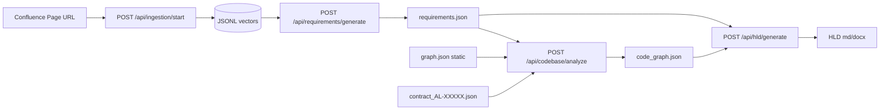

# MDD_NEW — HLD Generation Pipeline

Generates a **High-Level Design (HLD)** document by combining three inputs:

1. **Confluence pages** → structured requirements (`requirements_<timestamp>.json`)
2. **Monolith graph** (`graph.json`) + **feature contract** (`contract_AL-XXXXX.json`) → `code_graph_<timestamp>.json`
3. **HLD generator** → fuses both → `HLD_<timestamp>.md/.docx`

Built on the production-tested Confluence RAG stack from
[confluence-knowledge-chatbot](../confluence-knowledge-chatbot) — vector
ingestion, retriever, and chunker are reused verbatim. New services on top:
`llm_client`, `requirements_generator`, `codebase_analyzer`,
`hld_generator`, `mermaid_utils`.

> **LLM:** defaults to **Azure AI Foundry `Llama-3.3-70B-Instruct`** via
> `https://wdllmazureai.services.ai.azure.com/openai/v1/`. Switch providers
> with `LLM_PROVIDER` in `.env`.

---

## Repository layout

```
MDD_NEW/
├── graph.json                        # Monolith Graphify export (static, all features)
├── contract_AL-27103.json            # Per-feature scope + seedSymbols (one per ticket)
├── agentic-orchestrator/             # Graph query index (built from graph.json)
├── backend/
│   ├── main.py                       # FastAPI app, registers all routes
│   ├── models/schemas.py             # Pydantic request/response models
│   ├── routes/
│   │   ├── health.py                 # /api/health
│   │   ├── ingestion.py              # /api/ingestion  (Confluence -> JSONL)
│   │   ├── chat.py                   # /api/chat       (optional, kept for debugging)
│   │   ├── sessions.py               # /api/sessions   (chat session mgmt)
│   │   ├── requirements.py           # /api/requirements/generate   *** NEW ***
│   │   ├── codebase.py               # /api/codebase/analyze        *** NEW ***
│   │   └── hld.py                    # /api/hld/{generate,run,latest} *** NEW ***
│   └── services/
│       ├── artifact_store/           # Artifact paths, JSONL vector store, embedding/retriever handles
│       ├── confluence/               # Confluence client, preprocessing, chunking, retrieval
│       ├── requirements/             # Confluence RAG -> requirements artifacts
│       ├── codebase/                 # Contract + graph analysis -> code_graph artifacts
│       ├── hld/                      # HLD generation and validation
│       ├── mdd/                      # Module catalog, MDD generation, templates, diagrams
│       └── shared/                   # LLM client, Mermaid utilities, DOCX export
├── artifacts/                        # Product/release outputs (gitignored)
├── requirements.txt
├── .env.example                      # Defaults to Azure AI Foundry
└── README.md
```

---

## End-to-end pipeline



Or run the whole thing with a single call: `POST /api/hld/run`.

---

## Prerequisites

* Python 3.11+
* Confluence API token + access to the target space/page
* Azure AI Foundry API key (or your own OpenAI-compatible endpoint)

---

## Setup

```powershell
cd D:\MDD_NEW

# 1. Configure
Copy-Item .env.example .env  # then edit credentials
notepad .env

# 2. Python deps
python -m venv .venv
.\.venv\Scripts\Activate.ps1
pip install -r requirements.txt

# 3. Run the API
cd backend
python main.py
# -> http://localhost:8000/docs  (Swagger UI)
```

---

## Usage (curl / PowerShell)

### 1. Ingest a Confluence page
```bash
curl -X POST http://localhost:8000/api/ingestion/start \
  -H "Content-Type: application/json" \
  -d '{
    "confluence_url": "https://your.atlassian.net/wiki",
    "username": "you@example.com",
    "api_token": "<token>",
    "page_id": "1234567890",
    "product": "als",
    "release": "3.0_release"
  }'
```
Poll status at `GET /api/ingestion/status/{job_id}`.

### 2. Generate requirements
```bash
curl -X POST http://localhost:8000/api/requirements/generate \
  -H "Content-Type: application/json" \
  -d '{"product": "als", "release": "3.0_release", "n_results": 8}'
```
Writes `artifacts/als/3.0_release/hld/requirements_<timestamp>.json` plus `requirements.json` as the latest alias.

### 3. Analyze codebase (contract + monolith graph)

`graph.json` is configured once via `GRAPH_PATH` in `.env`. Per feature, pass only the contract:

```bash
curl -X POST http://localhost:8000/api/codebase/analyze \
  -H "Content-Type: application/json" \
  -d '{"product": "als", "release": "3.0_release", "ticket": "AL-27103"}'
```

Or explicitly:

```bash
curl -X POST http://localhost:8000/api/codebase/analyze \
  -H "Content-Type: application/json" \
  -d '{"contract_path": "contract_AL-27103.json"}'
```

Writes `artifacts/als/3.0_release/codebase/code_graph_<timestamp>.json`, `codebase_summary_<timestamp>.md`, and snapshots of `graph.json` / `contract.json`.

> Resolves each `seedSymbols.graphId` in the contract against the monolith
> graph index, then maps to `requirements.json` from Confluence.

### 4. Generate the HLD
```bash
curl -X POST http://localhost:8000/api/hld/generate \
  -H "Content-Type: application/json" \
  -d '{"product": "als", "release": "3.0_release"}'
```
Reads the staged requirements and code graph. Returns plan + diagram report.
The HLD itself is written as Markdown and DOCX under `artifacts/als/3.0_release/hld/`.

### 5. Module selection and generate MDDs (optional)

After the HLD exists, use the MDD API to multi-select logical modules and
generate one SOP-036 MDD Markdown/DOCX pair per selected module:

```bash
# 1) List all logical modules (logical_name + target_projects + symbols)
curl http://localhost:8000/api/mdd/modules

# 2) Generate one MDD file per selected module
curl -X POST http://localhost:8000/api/mdd/generate \
  -H "Content-Type: application/json" \
  -d '{
    "selected_modules": ["Food Module", "CGM Connection Service"],
    "ticket": "AL-27103"
  }'

# 3) Last generation metadata
curl http://localhost:8000/api/mdd/manifest

# 4) Download a module's MDD markdown or DOCX (module_slug)
curl http://localhost:8000/api/mdd/Food_Module
```

### Or do it all in one shot
```bash
curl -X POST http://localhost:8000/api/hld/run \
  -H "Content-Type: application/json" \
  -d '{
    "confluence_product": "welldoc",
    "ticket": "AL-27103",
    "n_results": 8
  }'
```

---

## Pipeline internals

### Requirements generator
* Runs a fixed suite of HLD-relevant probe queries (overview, functional,
  non-functional, modules, data, integrations, security, infra, constraints).
* Each probe uses the existing `EnhancedConfluenceRetriever.retrieve_enhanced`
  (vector + BM25 + cross-encoder).
* Concatenates the retrieved evidence with citations and asks the LLM to
  emit a single JSON object (`RequirementsDoc`) — no hallucination beyond
  the evidence window.

### Codebase analyzer
* Loads monolith `graph.json` from `GRAPH_PATH` (static, shared across features).
* Loads per-feature `contract_{ticket}.json` with curated `seedSymbols` and `graphId` pointers.
* Rebuilds query indices when `graph.json` changes.
* Resolves each contract seed against the monolith graph, expands 1-hop callers/callees.
* Maps Confluence `requirements.json` modules/APIs/flows to resolved symbols (contract-first, keyword fallback last).

### HLD generator
* **Pass 0 — Planner**: LLM decides which SOP-036 sections + diagrams apply.
* **Pass 1 — Compose**: LLM generates the Markdown HLD using the plan +
  both artifacts.
* **Pass 2 — Sanitize**: `mermaid_utils.postprocess_mermaid` fixes common
  Mermaid v11 LLM mistakes (rx/ry in classDef, `graph` → `flowchart`,
  unbalanced subgraph titles, reserved-word labels, …) and validates
  structural balance of every diagram block.
* **Pass 3 — Persist**: writes `HLD_<job>.md`, `plan_<job>.json`, and
  `hld_manifest_<job>.json` + refreshes the `_latest` pointers.

---

## Switching LLM providers at runtime

```bash
# Use AKS Mistral instead of Azure AI Foundry for one run
$env:LLM_PROVIDER = "aks"
# (then restart the API — providers are read from env on import)
```

---

## What was deliberately not copied from confluence-knowledge-chatbot

* **Frontend** (`frontend/`) — chat UI doesn't fit HLD generation. A
  separate UI for browsing artifacts can be added later.
* **k8s manifests / Dockerfile tuning** — out of scope for v1 of this
  pipeline; the existing `backend/Dockerfile` was carried over verbatim.
* **`retriver2.py` / `chunker_v2.py`** — kept for completeness/rollback,
  but the pipeline uses the v1 chunker + main retriever by default.
