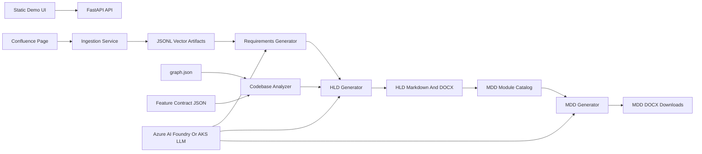

# VP Demo Architecture

## One-Line Summary
MDD_NEW converts Confluence requirements and codebase intelligence into traceable HLD and MDD documents through a FastAPI pipeline, reusable release artifacts, and configurable LLM generation.

## Executive View
The project automates design documentation for complex feature delivery. It takes three trusted inputs: Confluence product requirements, a Graphify monolith graph, and a per-feature contract JSON. The backend extracts requirements, maps them to impacted code areas, generates an HLD, builds a module catalog, and produces selected Module Detail Design documents as downloadable DOCX/Markdown artifacts.

## Architecture

## Demo Flow
1. Open the static demo UI served by `backend/main.py`.
2. Enter the Confluence page, product, release, ticket, and contract details.
3. Ingest Confluence content into release-scoped JSONL chunk and embedding artifacts.
4. Generate structured requirements from the Confluence evidence using RAG.
5. Analyze the codebase using `graph.json` and the feature contract.
6. Generate the HLD from requirements plus code graph context.
7. Review the generated HLD preview and downloadable DOCX.
8. Select logical modules from the catalog.
9. Generate one MDD per selected module and download the DOCX outputs.

## Key Components
- `frontend/index.html`: Demo screen for ingestion, artifact reuse, HLD preview, module selection, and downloads.
- `backend/main.py`: FastAPI entry point that registers ingestion, requirements, codebase, HLD, MDD, demo, and health APIs.
- `backend/routes/demo.py`: Demo helper APIs for safe Confluence ingestion, pasted contract storage, artifact status, and artifact downloads.
- `backend/routes/ingestion.py`: Confluence ingestion into searchable artifacts.
- `backend/routes/requirements.py`: Generates structured requirements from retrieved Confluence evidence.
- `backend/routes/codebase.py`: Resolves feature scope against `graph.json` and contract seed symbols.
- `backend/routes/hld.py`: Runs HLD generation and the end-to-end pipeline.
- `backend/routes/mdd.py`: Builds module catalog and generates selected MDD files.
- `backend/services/artifact_store/`: Product/release artifact paths, latest-run pointer, and JSONL vector storage.
- `backend/services/shared/llm_client.py`: OpenAI-compatible LLM client with Azure AI Foundry as default and AKS as an alternate provider.
- `backend/services/hld/hld_generator.py`: Plans SOP-036 sections, generates HLD Markdown, validates Mermaid, and exports DOCX.
- `backend/services/mdd/mdd_generator.py`: Generates one grounded MDD per selected module.

## Artifact Flow
- Confluence ingestion produces `chunks_*.jsonl`, `embeddings_*.jsonl`, and manifests.
- Requirements generation produces `requirements_*.json` and a latest alias.
- Codebase analysis produces `code_graph_*.json`, a contract snapshot, and codebase summary.
- HLD generation produces `HLD_*.json`, HLD Markdown content, diagram reports, plan JSON, manifest JSON, and DOCX.
- MDD generation produces module catalog JSON, MDD plan JSON, manifest JSON, and downloadable DOCX files.
- Artifacts are grouped by product and release under the configured artifact base directory.

## Conditions For A Successful Demo
- Confluence credentials and page access must be configured.
- `LLM_PROVIDER` must point to Azure AI Foundry or AKS with valid model configuration.
- `graph.json` must be available for the monolith code graph.
- A feature contract, such as `contract_AL-27103.json`, must provide ticket scope and seed symbols.
- Product and release values should be consistent across all steps so artifacts are reused correctly.
- The current demo build has open CORS and no app-level authentication; it is intended for controlled demo/runtime use.

## What Makes This More Than A Summarizer
- It does not only summarize Confluence. It combines requirement evidence with code graph impact analysis.
- It uses per-ticket contracts to keep generation scoped to the feature being designed.
- It stores intermediate artifacts, so the flow is repeatable and inspectable.
- It generates both HLD and per-module MDD outputs, which supports architecture review and developer handoff.
- It validates generated Mermaid diagrams and exports DOCX for business-friendly sharing.

## Likely Questions And Clear Answers
- Where does the information come from? Confluence provides requirements, `graph.json` provides code intelligence, and the contract JSON provides feature scope.
- How is traceability maintained? Each stage writes artifacts that can be inspected, reused, and tied to product/release context.
- What happens if Confluence is unavailable? Previously generated artifacts can be reused through the demo artifact status flow.
- What happens if required artifacts are missing? APIs return explicit errors and the user reruns the missing stage.
- How is the LLM controlled? The LLM is called through a shared provider wrapper and receives structured requirements/code context rather than free-form prompts alone.
- Can this support multiple releases? Yes. Artifacts are separated by product and release.
- Is this production secured? Not yet. The demo has no app-level auth and open CORS; production hardening should add authentication, authorization, restricted CORS, and secret management.
- What is the business outcome? Faster, more consistent design documents with less manual reconstruction of requirements and code impact.

## Demo Success Criteria
- HLD is generated from real requirements and code context.
- Architecture and Mermaid diagrams are visible in the HLD output.
- Module catalog is available for selection.
- Selected MDD DOCX files are generated and downloadable.
- The explanation is simple: evidence in, code-aware generation, reviewable documents out.
